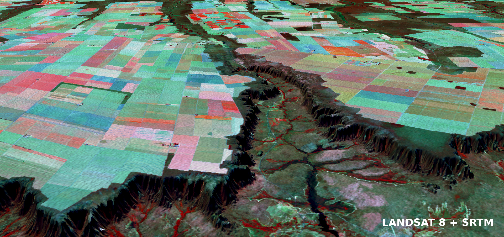

# 3D Terrain Visualization



### Requirements
* GDAL -- [Homepage](http://www.gdal.org)

### Install Gdal
```shell
$ sudo apt-add-repository ppa:ubuntugis/ubuntugis-unstable
$ sudo apt-get update
$ sudo apt-get install libgdal-dev
$ sudo apt-get install python3-dev
$ sudo apt-get install gdal-bin python3-gdal
```

### Create and activate a virtual environment
```shell
$ virtualenv env -p python3
$ source env/bin/activate
```

### Install Numpy
```shell
(env) $ pip3 install numpy
```
### Install GDAL
```shell
(env) $ pip3 install GDAL==$(gdal-config --version) --global-option=build_ext --global-option="-I/usr/include/gdal"
```

### Install vtk
```shell
(env) $ pip3 install python-vtk
```

### Install Mayavi
```shell
(env) $ pip3 install mayavi PyQt5
```

### Execute
```shell
(env) $ python3 visualize_3d.py landsat_8.tif srtm.tif
```
